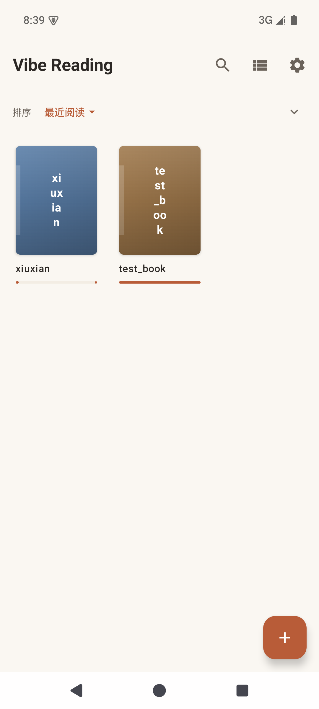
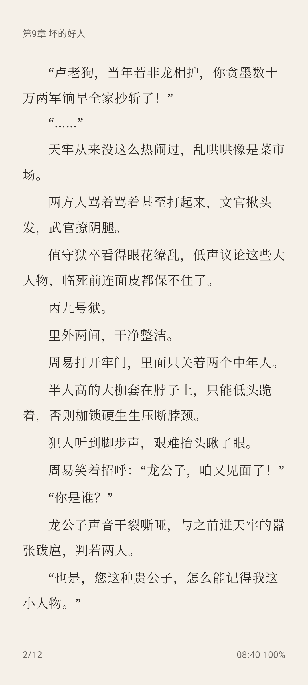
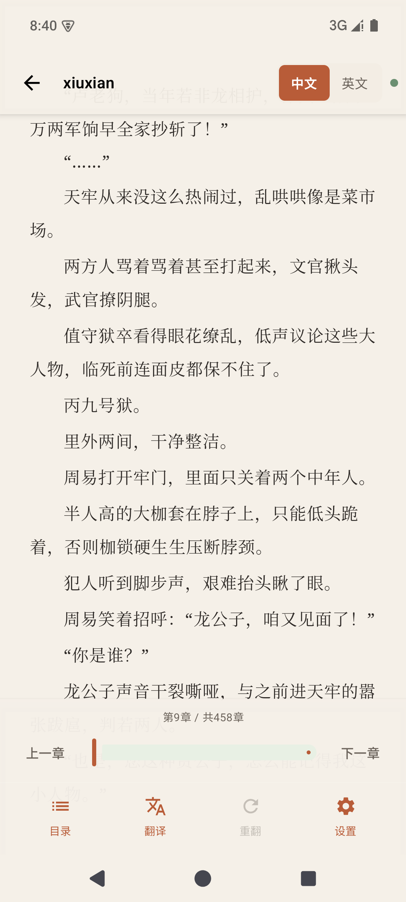
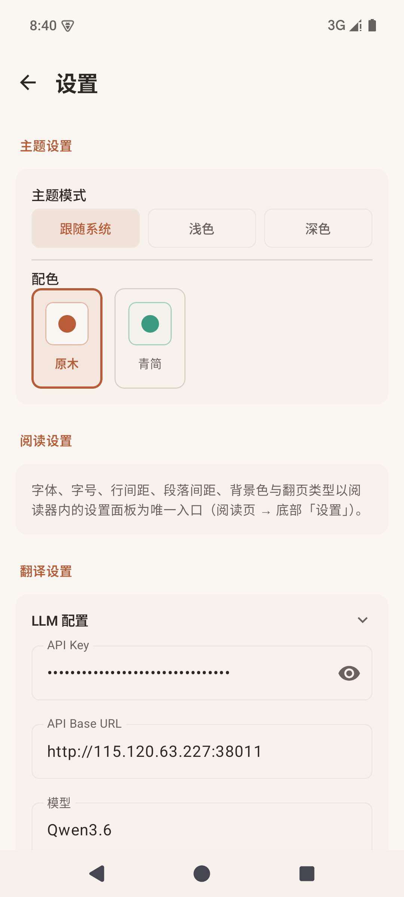

# VibeReading

**双语阅读器** — 导入 TXT 小说，逐章调用 LLM 翻译为英文，中文/英文双模式阅读。

## 功能

- **TXT 导入** — 通过系统文件选择器导入本地 TXT 小说，自动按章拆分
- **LLM 逐章翻译** — 支持 DeepSeek / OpenAI 兼容 API，SSE 流式实时显示翻译进度；可配置 API Key、Base URL、模型名、章节字数上限、上下文增强等
- **双语阅读** — 中文原文模式 / 英文译文模式（点击段落尾部气泡弹出中文原文）
- **五种翻页** — 滚动、平移、覆盖、无动画、仿真卷页（拖拽跟手 + 点按自动卷页）
- **排版引擎** — 基于 `TextMeasurer` 的行级整页排版，底部对齐，仿真卷页位图与 Compose 页视觉一致
- **阅读定制** — 字体/字号/行距/段距/页边距/字间距/首行缩进/两端对齐/5 种背景预设/夜间模式/单手模式
- **书架管理** — 列表/网格布局，按最近阅读/书名/上传时间排序，搜索
- **主题系统** — 跟随系统/浅色/深色 × 原木/青简强调色

## 截图

<p align="center">
  
  
  
  
</p>

## 技术栈

| 层 | 技术 |
|---|---|
| UI | Jetpack Compose + Material 3 |
| 架构 | 单 Activity，MVVM（手工依赖注入） |
| 本地存储 | Room + DataStore Preferences |
| 网络 | OkHttp + SSE（流式翻译） |
| 分页 | 自研行级排版引擎（`ChapterPaginator`） |
| 异步 | Kotlin Coroutines + Flow |

## 构建

### 环境要求

- **JDK 17**（必须；Android Studio 自带的 JBR/JDK 25 不适配当前 Gradle 配置）
- **Android SDK**：compileSdk 35，minSdk 26
- **Git**：版本号从 git tag 自动推导，确保仓库有 tag（如 `v0.1.6`）

### Debug 构建

```bash
./gradlew.bat :app:assembleDebug
```

Debug APK 输出：`app/build/outputs/apk/debug/app-x86_64-debug.apk`（按设备 ABI 选择）

### Release 构建

Release APK 需要签名。签名信息优先从环境变量读取（CI），其次从 `local.properties` 读取（本地）。

**1. 生成签名密钥（首次）**

```bash
keytool -genkey -v -keystore release.keystore -alias vibereading \
  -keyalg RSA -keysize 2048 -validity 10000
```

将生成的 `release.keystore` 放到项目根目录。

**2. 配置签名信息**

在项目根目录 `local.properties`（已 gitignore）中添加：

```properties
keystore.path=release.keystore
keystore.password=你的密钥库密码
key.alias=vibereading
key.password=你的密钥密码
```

**3. 打版本 tag**

```bash
git tag v1.2.3
```

tag 格式为 `v` + 语义版本号。构建时会自动将 `v1.2.3` 转为 `versionName = "1.2.3"`、`versionCode = 10203`。无 tag 时回退为 `0.0.0-dev`。

**4. 构建 Release APK**

```bash
./gradlew.bat :app:assembleRelease
```

输出按架构拆分（开启 ProGuard 混淆）：

```
app/build/outputs/apk/release/app-arm64-v8a-release.apk
app/build/outputs/apk/release/app-armeabi-v7a-release.apk
app/build/outputs/apk/release/app-x86_64-release.apk
app/build/outputs/apk/release/app-universal-release.apk
```

## 单测

```bash
./gradlew.bat :app:testDebugUnitTest
```

## License

[CC BY-NC 4.0](https://creativecommons.org/licenses/by-nc/4.0/) — 自由使用、修改和分享，但不可用于商业目的。
